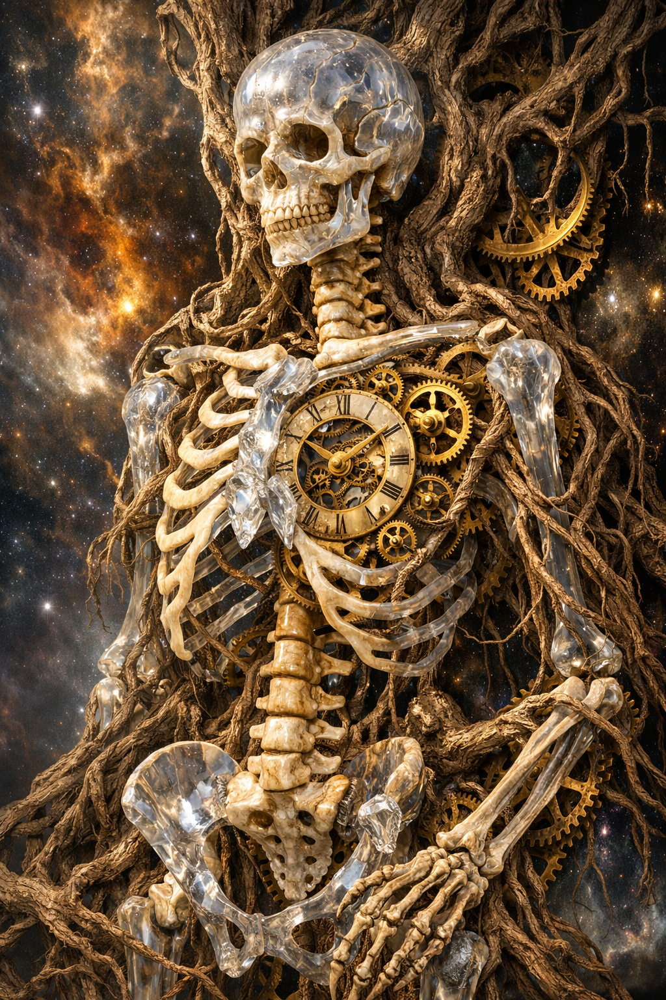
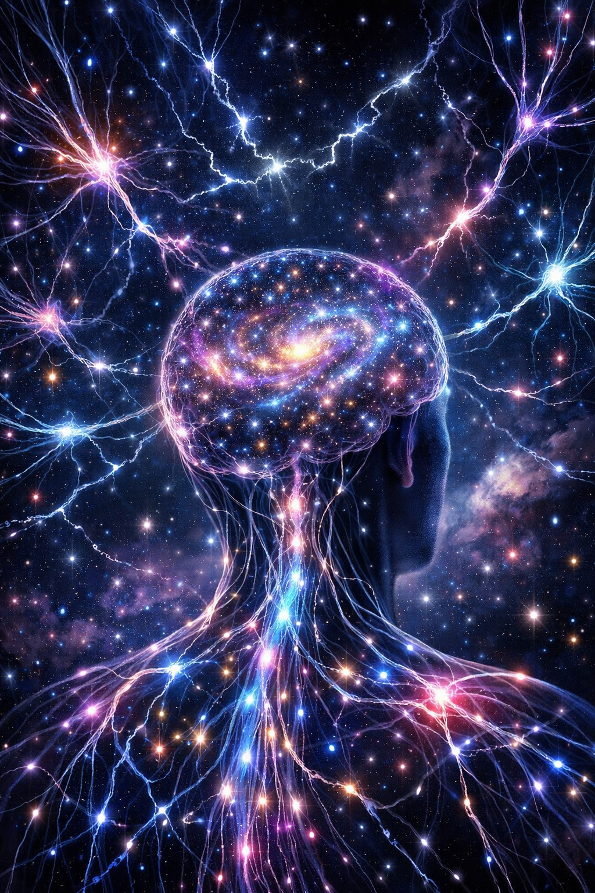
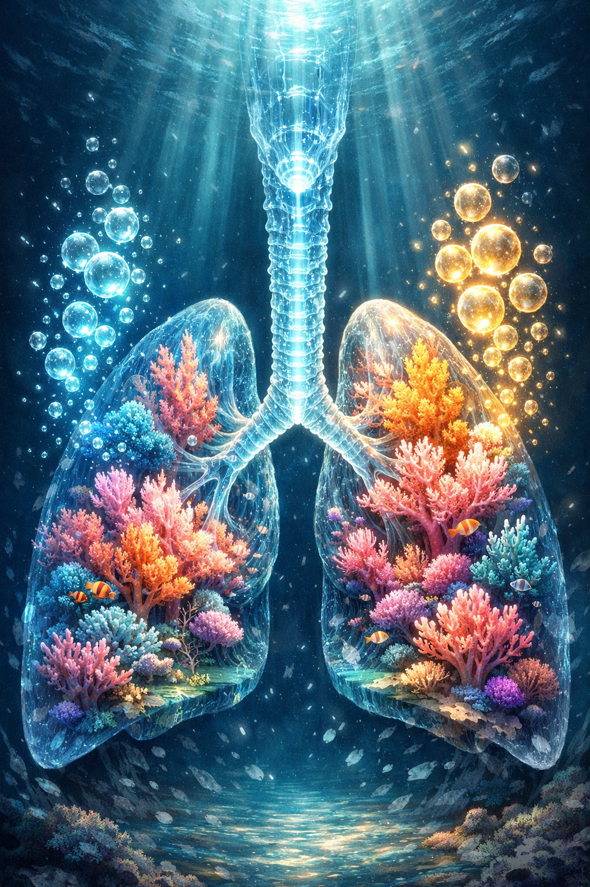

# Super Prompt Mestre: Anatomia e Fisiologia Humana Surrealista

## Introdução
Este prompt mestre foi concebido para gerar conteúdo abrangente e visualmente impactante sobre a anatomia e fisiologia humana, combinando rigor científico com uma estética surrealista. O objetivo é explorar a complexidade do corpo humano de uma maneira inovadora, utilizando metáforas visuais e conceitos artísticos para aprofundar a compreensão dos sistemas biológicos. A integração de referências acadêmicas e a inspiração na abordagem de visualização 3D do Visible Body Suite (2026) garantem a precisão e a profundidade do material gerado.

## Objetivo
O principal objetivo é criar descrições detalhadas e prompts visuais para cada sistema do corpo humano, permitindo a geração de imagens surrealistas que ilustrem suas funções e estruturas de forma única. Além disso, o prompt servirá como base para a criação de textos explicativos, simulações conceituais e outros materiais educativos que transcendam a representação tradicional.

## Metodologia
A abordagem será sistemática, cobrindo os principais sistemas do corpo humano. Para cada sistema, serão fornecidos:
1.  **Descrição Conceitual**: Uma visão geral de sua função e importância.
2.  **Prompt de Imagem Surrealista**: Detalhes para a geração de uma imagem que capture a essência do sistema com um toque artístico e onírico.
3.  **Conceitos Fisiológicos Chave**: Termos e processos fundamentais associados ao sistema.
4.  **Integração Visible Body Suite (Conceitual)**: Como a visualização 3D e a interatividade do Visible Body podem ser emuladas ou inspiradas na apresentação do conteúdo.

## Sistemas Anatômicos e Fisiológicos

### 1. Sistema Esquelético
**Descrição Conceitual**: A estrutura fundamental que sustenta o corpo, protege órgãos vitais e permite o movimento. É a base da nossa forma e resistência.
**Prompt de Imagem Surrealista**: "Sistema esquelético humano surrealista, ossos feitos de cristal translúcido e marfim esculpido, integrados a raízes de árvores antigas e engrenagens de relógio de ouro. Iluminação dramática, estilo Salvador Dalí encontra H.R. Giger. Fundo cósmico com nebulosas. Alta resolução, 8k." 
**Imagem**: 
**Conceitos Fisiológicos Chave**: Suporte, proteção, movimento, hematopoiese, armazenamento de minerais (cálcio, fósforo).
**Integração Visible Body Suite**: Visualização de camadas ósseas, articulações com movimentos simulados, identificação de cada osso e suas marcações anatômicas em 3D.

### 2. Sistema Muscular
**Descrição Conceitual**: A rede de tecidos que permite o movimento, mantém a postura e gera calor. É a força motriz por trás de cada ação.
**Prompt de Imagem Surrealista**: "Sistema muscular humano surrealista, fibras musculares como cordas de harpa de seda e feixes de energia cinética. Músculos em movimento fundindo-se com esculturas de mármore clássico que se fragmentam. Atmosfera de força e fragilidade. Estilo Pop Surrealism. Alta definição."
**Imagem**: 
**Conceitos Fisiológicos Chave**: Contração muscular, força, resistência, coordenação, termorregulação.
**Integração Visible Body Suite**: Dissecação virtual de grupos musculares, visualização de origens e inserções, animações de contração e relaxamento.

### 3. Sistema Nervoso
**Descrição Conceitual**: O centro de comando e comunicação do corpo, responsável por processar informações, coordenar ações e gerar pensamentos e emoções.
**Prompt de Imagem Surrealista**: "Sistema nervoso humano surrealista, neurônios como fios de fibra ótica brilhantes e constelações elétricas. O cérebro é uma galáxia em miniatura. Conexões sinápticas como relâmpagos em um céu noturno profundo. Estética de arte digital futurista e onírica."
**Imagem**: 
**Conceitos Fisiológicos Chave**: Neurotransmissão, potenciais de ação, plasticidade neural, percepção sensorial, controle motor.
**Integração Visible Body Suite**: Mapeamento de vias neurais, visualização de regiões cerebrais ativas, simulação de impulsos nervosos.

### 4. Sistema Cardiovascular
**Descrição Conceitual**: O sistema de transporte que leva oxigênio, nutrientes e hormônios para todas as células do corpo, removendo resíduos metabólicos.
**Prompt de Imagem Surrealista**: "Sistema cardiovascular humano surrealista, o coração como um motor alquímico de rubi e ouro, artérias e veias como rios de lava e mercúrio fluindo através de um labirinto de vidro. Estilo barroco surrealista, texturas ricas e iluminação de velas."
**Imagem**: 
**Conceitos Fisiológicos Chave**: Ciclo cardíaco, pressão arterial, circulação sistêmica e pulmonar, troca gasosa, regulação do fluxo sanguíneo.
**Integração Visible Body Suite**: Animações do batimento cardíaco, fluxo sanguíneo em 3D, identificação de vasos e câmaras cardíacas.

### 5. Sistema Respiratório
**Descrição Conceitual**: Responsável pela troca de gases entre o corpo e o ambiente, essencial para a oxigenação do sangue e a eliminação de dióxido de carbono.
**Prompt de Imagem Surrealista**: "Sistema respiratório humano surrealista, os pulmões como florestas de coral luminescente sob o mar, trocando oxigênio com bolhas de luz. A traqueia como um túnel de cristal. Estética etérea e serena. Estilo arte digital de fantasia."
**Imagem**: 
**Conceitos Fisiológicos Chave**: Ventilação pulmonar, difusão gasosa, controle da respiração, volumes pulmonares.
**Integração Visible Body Suite**: Visualização da mecânica respiratória, troca gasosa alveolar, estrutura dos brônquios e alvéolos.

### 6. Sistema Digestório
**Descrição Conceitual**: Processa os alimentos, absorve nutrientes e elimina resíduos, transformando o que comemos em energia e blocos construtores para o corpo.
**Prompt de Imagem Surrealista**: "Sistema digestório humano surrealista, um labirinto alquímico de recipientes de vidro e tubos de cobre transformando matéria em luz pura. O estômago como um caldeirão de fogo fátuo. Estilo steampunk surrealista."
**Imagem**: 
**Conceitos Fisiológicos Chave**: Digestão mecânica e química, absorção de nutrientes, motilidade gastrointestinal, metabolismo.
**Integração Visible Body Suite**: Animações do peristaltismo, visualização da absorção em vilosidades, órgãos acessórios e suas funções.

## Referências Acadêmicas e Científicas
Para a elaboração deste prompt, foram consultadas diversas fontes acadêmicas e científicas, garantindo a precisão dos conceitos anatômicos e fisiológicos. As principais referências incluem:

1.  **Livros-texto de Anatomia e Fisiologia**: Obras clássicas como "Anatomia e Fisiologia do Corpo Humano Saudável e Enfermo" [1], "Fisiologia Humana: Das Células aos Sistemas" [2] e "Anatomia Humana" [3] serviram como base para a terminologia e os conceitos fundamentais.
2.  **Portais Acadêmicos**: Plataformas como EducaPES (CAPES) [4], Scielo e PubMed foram utilizadas para a pesquisa de artigos e estudos recentes que complementam o conhecimento tradicional.
3.  **Visible Body Suite**: Embora proprietário, o conceito de visualização 3D interativa e a organização por sistemas do Visible Body Suite [5] foram uma inspiração crucial para a estrutura e a profundidade da representação anatômica.

## Estilo e Tom
O estilo do conteúdo gerado deve ser uma fusão de **científico e poético**. A linguagem deve ser precisa e informativa, mas também evocativa e imaginativa, refletindo a natureza surrealista das imagens. O tom deve ser de admiração pela complexidade do corpo humano, incentivando a curiosidade e a exploração.

## Instruções para Geração de Conteúdo
Ao utilizar este prompt, considere as seguintes diretrizes:
*   **Contexto**: Sempre comece contextualizando o sistema em questão, sua importância e sua relação com outros sistemas.
*   **Detalhes Visuais**: Ao gerar imagens, utilize os prompts fornecidos como ponto de partida, mas sinta-se à vontade para adicionar detalhes que enriqueçam a cena surrealista, mantendo a fidelidade ao conceito anatômico/fisiológico.
*   **Explicações Aprofundadas**: Para cada conceito fisiológico chave, solicite uma explicação detalhada que possa ser integrada ao material educativo.
*   **Interatividade (Conceitual)**: Pense em como o conteúdo poderia ser apresentado em um ambiente interativo, como o Visible Body, com camadas que podem ser ativadas/desativadas, ou com a possibilidade de "dissecar" virtualmente as estruturas.
*   **Novos Sistemas**: Este prompt pode ser expandido para incluir outros sistemas (Endócrino, Linfático, Urinário, Reprodutor, Tegumentar) seguindo a mesma metodologia.

---

### Referências
[1] Anatomia e Fisiologia Humana a Incrível Máquina do Corpo Humano. Disponível em: [https://educapes.capes.gov.br/handle/capes/432728](https://educapes.capes.gov.br/handle/capes/432728)
[2] Fisiologia humana: das células aos sistemas. Disponível em: [https://saocamilo-sp.br/_app/views/publicacoes/outraspublicacoes/Caderno%20de%20apoio%20ao%20estudo%20de%20anatomia%20humana_final.pdf](https://saocamilo-sp.br/_app/views/publicacoes/outraspublicacoes/Caderno%20de%20apoio%20ao%20estudo%20de%20anatomia%20humana_final.pdf)
[3] VAN DE GRAAFF, K. M. Anatomia humana. 6. ed. São Paulo: Manole, 2003. (Mencionado em [https://saocamilo-sp.br/_app/views/publicacoes/outraspublicacoes/Caderno%20de%20apoio%20ao%20estudo%20de%20anatomia%20humana_final.pdf](https://saocamilo-sp.br/_app/views/publicacoes/outraspublicacoes/Caderno%20de%20apoio%20ao%20estudo%20de%20anatomia%20humana_final.pdf))
[4] EducaPES - Portal de Periódicos da CAPES. Disponível em: [https://educapes.capes.gov.br/](https://educapes.capes.gov.br/)
[5] Visible Body Suite. Disponível em: [https://www.visiblebody.com/anatomy-and-physiology-apps/vb-suite](https://www.visiblebody.com/anatomy-and-physiology-apps/vb-suite)
